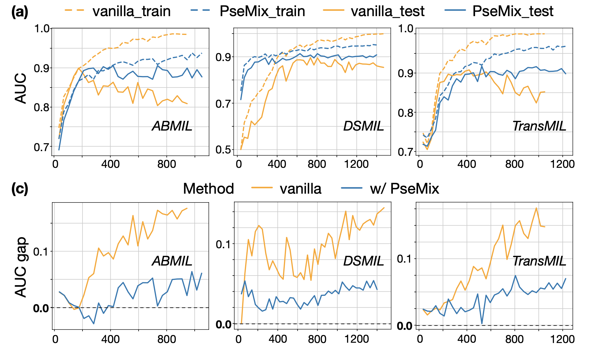

# PseMix: Pseudo-Bag Mixup Augmentation for MIL-Based Whole Slide Image Classification 

*IEEE Transaction on Medical Imaging, 2024*

[[Journal Link]](https://ieeexplore.ieee.org/abstract/document/10385148) | [[arXiv]](https://arxiv.org/abs/2306.16180) | [[PseMix Walkthrough]](https://github.com/liupei101/PseMix?tab=readme-ov-file#psemix-walkthrough) | [[WSI Preprocessing]](https://github.com/liupei101/PseMix?tab=readme-ov-file#wsi-preprocessing) | [[Related Resources]](https://github.com/liupei101/PseMix?tab=readme-ov-file#-related-resources) | [[Citation]](https://github.com/liupei101/PseMix?tab=readme-ov-file#-citation)

**Abstract**: Multiple instance learning (MIL) has become one of the most important frameworks for gigapixel Whole Slide Images (WSIs). In current practice, most MIL networks often face two unavoidable problems in training: i) insufficient WSI data and ii) the sample memorization inclination inherent in neural networks. To address these problems, this paper proposes a new Pseudo-bag Mixup (PseMix) data augmentation scheme, inspired by the basic idea of Mixup. Cooperated by pseudo-bags, this scheme fulfills the critical size alignment and semantic alignment in Mixup. Moreover, it is efficient and plugin-and-play, neither involving time-consuming operations nor relying on model predictions. Experimental results show that PseMix could often improve the performance of state-of-the-art MIL networks. Most importantly, it could also boost the generalization performance of MIL models in special test scenarios, and promote their robustness to patch occlusion and label noise. 

<!-- Insert a pipeline of your algorithm here if got one -->
<div align="center">
    <a href="https://"></a>
</div>

---

📚 Recent updates:
- 24/05/19: add `data_split` and [Notebook - Generate Data Split](https://github.com/liupei101/PseMix/blob/main/notebooks/generate_data_split_npz.ipynb)
- 24/05/09: add two PseMix Walkthrough notebooks: [Notebook - Pseudo-bag Generation](https://github.com/liupei101/PseMix/blob/main/notebooks/psemix_walkthrough_step1_pseudo_bag_generation.ipynb) and [Notebook - Pseudo-bag Mixup](https://github.com/liupei101/PseMix/blob/main/notebooks/psemix_walkthrough_step2_pseudo_bag_mixup.ipynb)
- 24/05/08: add link to [a detailed tutorial of WSI preprocessing](https://github.com/liupei101/Pipeline-Processing-TCGA-Slides-for-MIL)
- 24/02/27: add missing codes regrading the module of `optim`
- 24/02/22: add useful research papers involving pseudo-bags


## Why use PseMix?

Adopting PseMix in training MIL networks could 

(1) **improve performance with minimal costs**:

| Network | BRCA | NSCLC | RCC | Average AUC                              |
|---------|------|-------|-----| :--------------------------------------: |
| [ABMIL](https://proceedings.mlr.press/v80/ilse18a.html)   | 87.05 | 92.23 | 97.36 | 92.21 |
| [ABMIL](https://proceedings.mlr.press/v80/ilse18a.html) **w/ PseMix**   | **89.49** | **93.01** | **98.02** | **93.51** |
| [DSMIL](https://openaccess.thecvf.com/content/CVPR2021/papers/Li_Dual-Stream_Multiple_Instance_Learning_Network_for_Whole_Slide_Image_Classification_CVPR_2021_paper.pdf)   | 87.73 | 92.99 | 97.65 | 92.79 |
| [DSMIL](https://openaccess.thecvf.com/content/CVPR2021/papers/Li_Dual-Stream_Multiple_Instance_Learning_Network_for_Whole_Slide_Image_Classification_CVPR_2021_paper.pdf) **w/ PseMix**   | **89.65** | **93.92** | **97.89** | **93.82** |
| [TransMIL](https://openreview.net/forum?id=LKUfuWxajHc)   | 88.83 | 92.14 | 97.88 | 92.95 |
| [TransMIL](https://openreview.net/forum?id=LKUfuWxajHc) **w/ PseMix**   | **90.40** | **93.47** | **97.76** | **93.88** |

(2) **obtain better generalization and robustness**:

Training curves, showing the AUC performance on training and test data (exported from wandb), are given below.  

<div align="left">
    <a href="https://"></a>
</div>

## PseMix Walkthrough

PseMix contains two key steps: i) pseudo-bag generation and ii) pseudo-bag mixup. 

There are alternative ways for you to quickly understand the key steps inner PseMix:
- Two notebooks to help you get started with PseMix: [Notebook - Pseudo-bag Generation](https://github.com/liupei101/PseMix/blob/main/notebooks/psemix_walkthrough_step1_pseudo_bag_generation.ipynb) and [Notebook - Pseudo-bag Mixup](https://github.com/liupei101/PseMix/blob/main/notebooks/psemix_walkthrough_step2_pseudo_bag_mixup.ipynb).
- an overall description of the two steps, given below. 

### Step 1. Pseudo-bag Generation

Pseudo-bag generation contains two sub-steps:
- Phenotype clustering by 
  - bag-prototype-based instance clustering
  - cluster fine-tuning
- Phenotype-stratified sampling

Its implementation details can be found via the function [`generate_pseudo_bags`](https://github.com/liupei101/PseMix/blob/main/utils/core.py#L146C13-L146C13). This predefined function will be directly used and called in the next step, pseudo-bag mixup. 

### Step 2. Pseudo-bag Mixup

Below is the pseudo-code of pseudo-bag mixup:

```python
# generate_pseudo_bags: function for dividing WSI bags into pseudo-bags
# ALPHA: the hyper-parameter of Beta distribution
# N: the number of pseudo-bags in each WSI bag
# PROB_MIXUP: random mixing parameter for determining the proportion of mixed bags. 
for (X, y) in loader: # load a minibatch 
    n_batch = X.shape[0] # with `n_batch` WSI bags (samples)

    # 1. dividing each bag into `N` pseudo-bags
    X = generate_pseudo_bags(X)

    new_idxs = torch.randperm(n_batch)
    # draw a mixing scale from Beta distribution
    lam = numpy.random.beta(ALPHA, ALPHA) 
    lam = min(lam, 1.0 - 1e-5) # avoid numerical overflow when transforming it into discrete ones
    lam_discrete = int(lam * (N + 1)) # transform into discrete values

    # 2. pseudo-bag-level Mixup generates samples (new_X, new_y)
    new_X, new_y = [], []
    for i in range(n_batch):
    	# randomly select pseudo-bags according to `lam_discrete`
        masked_bag_A = select_pseudo_bags(X[i], lam_discrete) # select `lam_discrete` pseudo-bags
        masked_bag_B = select_pseudo_bags(X[new_idxs[i]], N - lam_discrete) # select `n-lam_discrete` pseudo-bags

        # random-mixing mechanism for two purposes: more data diversity and efficient learning on mixed samples.
        if np.random.rand() <= PROB_MIXUP:
            mixed_bag = torch.cat([masked_bag_A, masked_bag_B], dim=0) # instance-axis concat
            new_X.append(mixed_bag)
            mix_ratio = lam_discrete / N
        else:
            masked_bag = masked_bag_A 
            new_X.append(masked_bag)
            mix_ratio = 1.0

        # target-level mixing
        new_y.append(mix_ratio * y[i] + (1 - mix_ratio) * y[new_idxs[i]]) 

    # 3. minibatch training
    minibatch_training(new_X, new_y)
```

**More details** can be found by

- [pseudo-bag-level Mixup](https://github.com/liupei101/PseMix/blob/main/utils/core.py#L13C10-L13C10).
- [training with mixed labels](https://github.com/liupei101/PseMix/blob/main/model/clf_handler.py#L381).
- [weighted loss for mixed samples](https://github.com/liupei101/PseMix/blob/main/model/clf_handler.py#L407), following [the implementation of Mixup](https://github.com/facebookresearch/mixup-cifar10).

## WSI Preprocessing

The procedure of WSI preprocessing is elaborated in [Pipeline-Processing-TCGA-Slides-for-MIL](https://github.com/liupei101/Pipeline-Processing-TCGA-Slides-for-MIL). Please move to it for a detailed tutorial.

## 👩‍💻 Running the Code

Using the following command to load running configurations from a yaml file and train the model:
```bash
python3 main.py --config config/cfg_clf_mix.yml --handler clf --multi_run
```

The configurations that we need to pay attention are as follows:
- Dataset (we process WSIs with [CLAM](https://github.com/mahmoodlab/CLAM))
  - `path_patch`: the directory path to patch files. 
  - `path_table`: the file path of a csv table that contains WSI IDs and their label information.
  - `data_split_path`: the file path of a npz file that stores data splitting information. 
- Network
  - `net_dims`: the setting of embedding dimension, e.g., `1024-256-2`.
  - `backbone`: network backbone, one of `ABMIL`, `DSMIL`, and `TransMIL`.
- Pseudo-bag Dividing
  - `pseb_dividing`: the method used to divide instances, one of `proto`, `kmeans`, and `random`.
  - `pseb_n`: the number of pseudo-bags for each WSI bag, 30 by default.
  - `pseb_l`: the number of phenotypes, 8 by default.
  - `pseb_iter_tuning`: the number of fine-tuning iterations, 8 by default.
  - `pseb_mixup_prob`: the probability of random-mixing.
- Pseudo-bag Mixup
  - `mixup_type`: the method of Mixup, `psebmix` by default.
  - `mixup_alpha`: the parameter of beta distribution, i.e., the value of alpha. 

Other configurations are explained in `config/cfg_clf_mix.yml`. They could remain as before without any changes. 

## 🔥 Related Resources

Here we list the related works involving **pseudo-bags** or using **pseudo-bags for training deep MIL networks**.

| Model          | Subfield    | Paper             | Code            | Base   |
| :------------- | :---------- | :---------------- | :-------------- | :----- |
| BDOCOX (TMI'21)         | WSI Survival Analysis | [Weakly supervised deep ordinal cox model for survival prediction from wholeslide pathological images](https://ieeexplore.ieee.org/document/9486947) | - | K-means-based pseudo-bag division |
| DTFD-MIL (CVPR'22)      | WSI Classification    | [Dtfd-mil: Double-tier feature distillation multiple instance learning for histopathology whole slide image classification](https://arxiv.org/abs/2203.12081) | [Github](https://github.com/hrzhang1123/DTFD-MIL)            | Random pseudo-bag division   |
| ProDiv (CMPB'24)     | WSI Classification    | [ProDiv: Prototype-driven Consistent Pseudo-bag Division for Whole-slide Image Classification](https://www.sciencedirect.com/science/article/pii/S0169260724001573) | [Github](https://github.com/UESTC-nnLab/ProDiv)            | Prototype-based consistent pseudo-bag division     |
| PseMix (TMI'24)         | WSI Classification   | [Pseudo-Bag Mixup Augmentation for Multiple Instance Learning-Based Whole Slide Image Classification](https://ieeexplore.ieee.org/abstract/document/10385148) | [Github](https://github.com/liupei101/PseMix)                 | Pseudo-bag Mixup  |
| ICMIL       | WSI classification    | [Rethinking Multiple Instance Learning for Whole Slide Image Classification: A Bag-Level Classifier is a Good Instance-Level Teacher](https://arxiv.org/abs/2312.01099) | [Github](https://github.com/Dootmaan/ICMIL)           |  Utilizing pseudo-bags in training   |
| PMIL       | WSI classification     | [Shapley Values-enabled Progressive Pseudo Bag Augmentation for Whole Slide Image Classification](https://arxiv.org/abs/2312.05490) | -         |   Progressive pseudo-bag augmentation  |

**NOTE**: please open *a new PR* if you want to add your work in this resource list.

## 📝 Citation

If you find this work helps your research, please consider citing our paper:
```txt
@article{liu10385148,
  author={Liu, Pei and Ji, Luping and Zhang, Xinyu and Ye, Feng},
  journal={IEEE Transactions on Medical Imaging}, 
  title={Pseudo-Bag Mixup Augmentation for Multiple Instance Learning-Based Whole Slide Image Classification}, 
  year={2024},
  volume={43},
  number={5},
  pages={1841-1852},
  doi={10.1109/TMI.2024.3351213}
}
```
or `P. Liu, L. Ji, X. Zhang and F. Ye, "Pseudo-Bag Mixup Augmentation for Multiple Instance Learning-Based Whole Slide Image Classification," in IEEE Transactions on Medical Imaging, vol. 43, no. 5, pp. 1841-1852, May 2024, doi: 10.1109/TMI.2024.3351213.`
